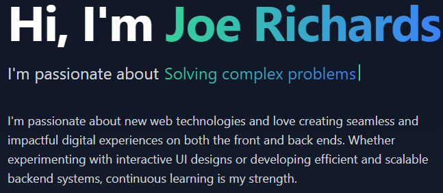

# About Me

Having more than 8+ extensive experiences in Software Design and Development with role of Lead web developer, PHP/UX architect for dozens of commercial sites in various Web technologies (PHP, Perl, Python, Full Stack, AWS, Cloud computing, Devops task,CICD, Angularjs, Reactjs, Vuejs,nextjs, any PHP CMS, ANY php framework, Flask, Fastapi, Django, Drupal, Wordpress, Joomla, Laravel, Mean Stack, and MERN Stack with different library/frameworks of JavaScript as well as PHP). Worked on real-time web applications, complex back-end management systems, content management, e-commerce. Eager to develop unique complex challenging web concepts. Enjoy learning new languages, technologies and ideas.
 
Specialties:  
• Web site development with security access  
• Open Source Technologies  
• Asynchronous/event driven programming  
• front-end design patterns  
• cross browser performance optimization  
• real-time web applications  
• dynamic content applications  
• internet marketing  
• e-commerce applications  
• content management systems  
• software testing  
• Project Management & team Management Professional Skills:  
• Programming Languages/Technologies 
 o PHP with OOP , Perl, Python, Ruby 
 o JavaScript With OOP 
 o AJAX  
• Frameworks 
 o Zend 
 o Symfony 
 o CakePHP 
 o PEAR  
• ORMs and DB Abstraction Layers 
 o Doctrine 
 o Propel  
• Template Engines o Smarty  
• JavaScript Libraries 
 o jQuery 
 o Prototype  
• Databases 
 o Generic SQL programming 
 o MySQL 
 o PostgreSQL 
 o MANGODB  
• Web Standards 
 o HTML 5, HTML 4.01, XHTML 1.0/1.1 
 o XML 
 o CSS1, CSS2, CSS3 
 o DOM 
 o JSON 
 o WEB SERVICES(REST,SOAP) 
 o XSLT 

Industry expertise: IT, Real Estate, Software, Technology and Trave 

## My Projects

